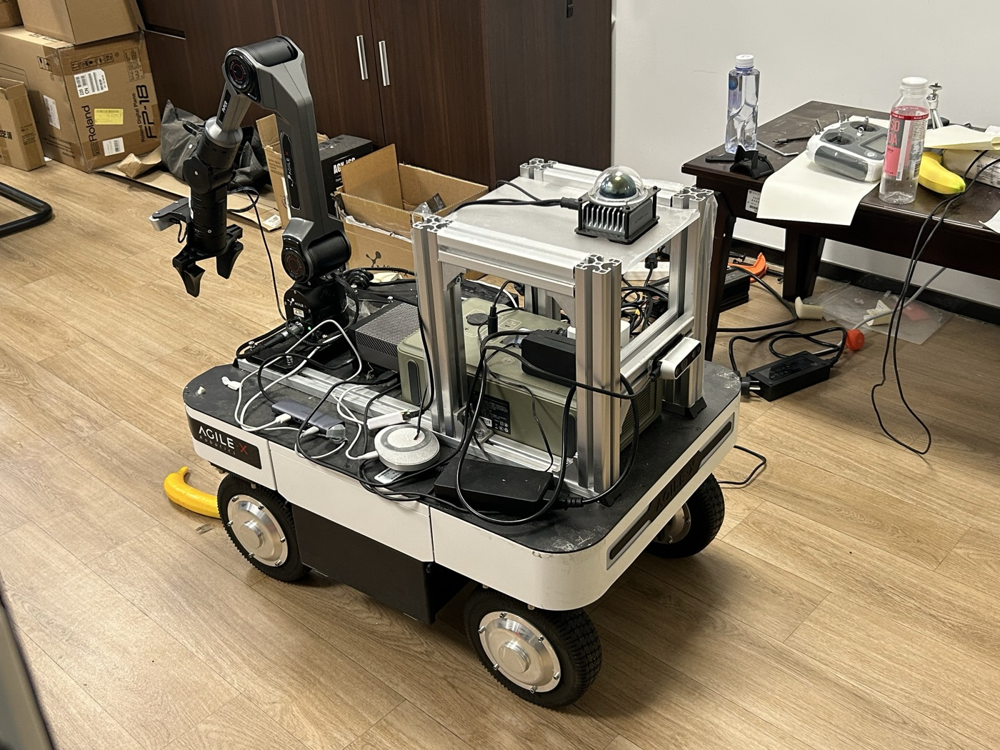

# AgileX Ranger Mini v3

Robonix deployment for the SysWonder Ranger Mini v3: Jetson Orin, Livox
MID-360, Intel RealSense D435i, RTAB-Map, Scene, Nav2, and Explore.

The deployment uses native ROS 2 packages on Jetson. Zenoh RMW is the default;
`start.sh` starts a local `rmw_zenohd` for the lifetime of the boot.
Scene, Mapping, and Nav2 are explicitly selected for their Jetson-native paths.
Each package entry selects its own `package_manifest*.yaml`, so architecture and
native/container choices are package properties rather than global environment
variables. The same robot repository may therefore keep separate full/no-arm
deployment manifests while selecting the appropriate package target for each
component.



## Hardware

| Component | Model | Deployment configuration |
| --- | --- | --- |
| Mobile base | AgileX Ranger Mini v3 | Four-wheel steer/drive chassis; `can_ranger` at 500 kbit/s; `base_link` footprint 0.74 m x 0.50 m |
| Compute | NVIDIA Jetson AGX Orin | aarch64 Jetson-native packages, ROS 2 Humble, and `rmw_zenoh_cpp` |
| Manipulator | AgileX Piper | Six-axis arm with parallel gripper; `can_piper` at 1 Mbit/s |
| 3D lidar and IMU | Livox MID-360 | Ethernet lidar at `192.168.1.161`; host interface `192.168.1.50`; lidar and integrated IMU are separate Robonix providers |
| Front RGB-D camera | Intel RealSense D435i | 640 x 480 at 30 FPS for RGB and aligned depth; spatial and temporal depth filters enabled; camera IMU disabled |
| Wrist camera | Orbbec Dabai DCW | 1280 x 720 YUYV color at 10 FPS; depth is disabled in the current pick pipeline |
| Audio | USB audio device | 16 kHz mono microphone and speaker through `plughw:CARD=Plus,DEV=0` |

The exact provider IDs, device addresses, sensor profiles, and runtime options
are defined in [`robonix_manifest.yaml`](robonix_manifest.yaml). The robot body,
component hierarchy, footprint, and provider-to-component mapping are defined
in [`soma.yaml`](soma.yaml). Vitals consumes Soma's body-health stream and
aggregates Robonix module health on port `50093` for trusted operator clients.

Robot-specific algorithm configuration is also deployment-owned:

- [`config/rtabmap_params.yaml`](config/rtabmap_params.yaml) contains the full
  Ranger RTAB-Map parameter set.
- [`config/nav2_params.yaml`](config/nav2_params.yaml) contains the complete
  Ranger Nav2 configuration.
- [`config/navigate.xml`](config/navigate.xml) contains the Ranger navigation
  BehaviorTree.
- [`config/calibration/2d_homography.npy`](config/calibration/2d_homography.npy)
  is the hand-eye calibration for this Ranger's Piper wrist-camera mount. It is
  a deployment asset, not a generated `rbnx-boot` cache file. Recalibrate and
  replace it after changing the camera mount or arm/workspace geometry.
- [`urdf/piper.urdf`](urdf/piper.urdf) is the six-joint Piper kinematic model
  consumed by `roboarm_ik`. The manifest references this versioned deployment
  asset through `${ROBONIX_DEPLOY_DIR}` so a fresh clone does not depend on a
  cache path or another checkout.

The manifest references these files with paths relative to this repository.
The Mapping and Navigation provider repositories contain templates only; do
not move Ranger dimensions, sensor limits, or controller policy upstream.

Package target selection and algorithm configuration are separate. A package's
`manifest:` chooses a build/start implementation such as Jetson native or a
container. If a provider exposes a named `params_profile`, that name must be one
the provider implements upstream; a robot manifest cannot invent a new profile.
Robot-specific runtime values remain in this repository's parameter files (or
documented config overrides) and do not create a new upstream profile.

Scene is pinned to `realsense_camera`. That provider supplies both aligned RGB
and depth (plus camera calibration); the wrist Orbbec cannot be selected by
Atlas ordering. Scene obtains the robot's globally corrected pose from the
Mapping `robonix/service/map/pose` contract and combines it with the complete
URDF camera transform published by `robot_description`.

## Prepare

Robonix `dev` is the recommended branch for ordinary deployments. This
repository currently reproduces the Ranger integration stack on `dev-next`
(including provider-pinned Scene RGB-D ingest); use `dev-next` until those
changes are merged into `dev`. Then install the ROS dependencies once:

```bash
cd ~/wheatfox/robonix
git switch dev-next
git pull --ff-only origin dev-next
make install

sudo apt install ros-humble-rmw-zenoh-cpp \
  ros-humble-rtabmap-ros ros-humble-navigation2 ros-humble-nav2-bringup
```

Create a private environment file; never commit credentials:

```bash
cp .env.example .env
$EDITOR .env
```

`start.sh` loads this ignored file automatically and exports it to every
Robonix child process. Keep VLM and Tencent SecretId/SecretKey here; keep
non-secret backend, AppID, engine, voice, and region settings in
`robonix_manifest.yaml`.

## Build and boot

```bash
bash build.sh
bash start.sh
```

The wrappers set `ROBONIX_DEPLOY_DIR`, source ROS Humble, and keep the Zenoh
router lifecycle tied to `rbnx boot`. Each package's selected manifest chooses
its Jetson-native build and start commands.

Operator pages:

- Scene: `http://<robot-host>:50107/`
- Mapping: `http://<robot-host>:8091/`
- Atlas for Robonix Client: `<robot-host>:50051`
- Liaison for Robonix Client: `<robot-host>:50081`

Static deployment checks do not start hardware:

```bash
python3 -m unittest -v \
  test_manifest_config.py test_nav2_config.py test_nav2_acceptance.py
```

## RViz

The deploy keeps the complete v0.1 RViz configuration and an updated mapping
variant. The updated file preserves the original map, costmap, scan, path,
goal, TF, particle-cloud, and footprint displays, and adds the Soma-backed
RobotModel plus the live MID-360 `/scanner/cloud` display.

```bash
source /opt/ros/humble/setup.bash
export RMW_IMPLEMENTATION=rmw_zenoh_cpp
rviz2 -d rviz/ranger_mapping.rviz
```

The unchanged historical configuration is `rviz/ranger_v0.1.rviz`.

## Safety and bring-up order

The checked-in full manifest includes the chassis, Piper arm, Nav2, and skills;
starting it exposes physical motion capabilities. Keep the hardware emergency
stop available and clear the workspace before full bring-up.

After the chassis is powered on:

1. Verify `can_ranger` is UP and odometry is publishing.
2. Send zero Twist and confirm the watchdog holds the base stopped.
3. Use a low-speed, short-duration command in a clear area.
4. Verify Mapping pose and Nav2 costmaps before sending a nearby goal.
5. Only then test Explore.

## Robot description

`soma.yaml` and `urdf/ranger_mini.urdf` are served by Soma. The description
contains the body footprint and sensor tree used by Pilot and other consumers.
`urdf/piper.urdf` is currently a separate arm-only model used by the IK solver;
it is not a substitute for the Soma body tree. Mount transforms remain
calibration-sensitive; update the body URDF after physical measurement rather
than compensating in Scene or Mapping.
